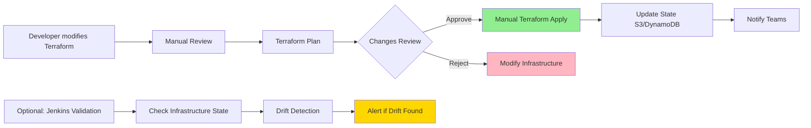
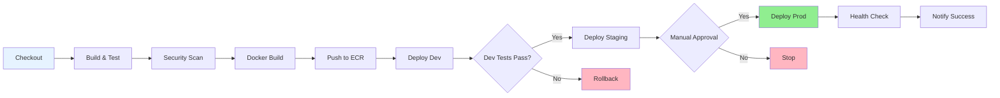
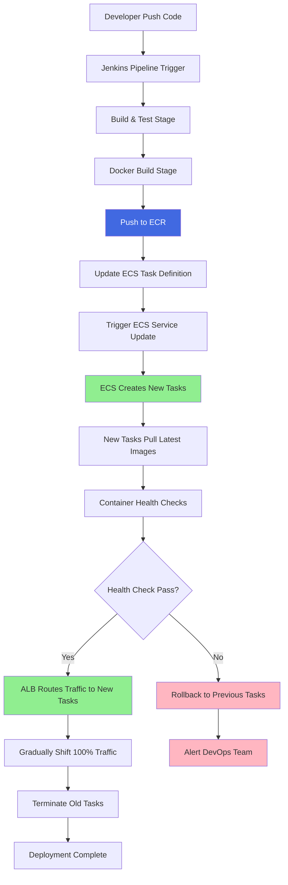
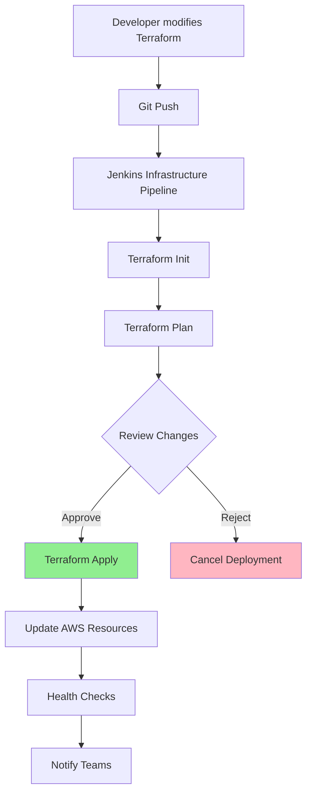
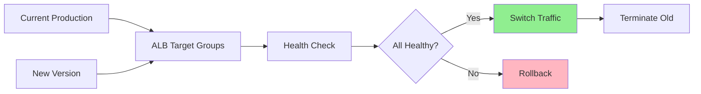

# AWS Complete Architecture - Psychological Healthcare System

## Overview

Complete AWS cloud architecture for microservices-based Psychological Healthcare system with comprehensive CI/CD pipeline using Jenkins, featuring Infrastructure as Code (Terraform) and containerized deployment on AWS ECS Fargate.

## Complete Architecture Diagram

### **📋 Route Table Configuration**

| Route Table             | Physical Location                  | Destination   | Target           | Purpose                               |
| ----------------------- | ---------------------------------- | ------------- | ---------------- | ------------------------------------- |
| **Public Route Table**  | Within Public Subnet 1             | `10.0.0.0/16` | Local            | Internal VPC communication            |
| **Public Route Table**  | (also applies to Public Subnet 2)  | `0.0.0.0/0`   | Internet Gateway | Internet access for public resources  |
| **Private Route Table** | Within Private Subnet 1            | `10.0.0.0/16` | Local            | Internal VPC communication            |
| **Private Route Table** | (also applies to Private Subnet 2) | `0.0.0.0/0`   | NAT Gateway      | Internet access for private resources |

```mermaid
graph TB
    %% External Components
    User["👤 User/Client"]
    Admin["👤 Admin"]
    Developer["👨‍💻 Developer"]

    %% GitHub
    GitHub["📱 GitHub Repository<br/>Source Code<br/>Webhooks<br/>Branch: develop/staging/main"]

    %% Internet Gateway
    IGW["🌐 Internet Gateway"]

    %% AWS Cloud
    subgraph AWS["☁️ AWS Cloud"]
        %% VPC
        subgraph VPC["🔗 VPC 10.0.0.0/16"]
            %% Public Subnets
            subgraph PublicSubnet1["🌍 Public Subnet 1 10.0.1.0/24 (ap-southeast-1a)"]
                %% Public Route Table (associated with this subnet)
                PublicRT["📋 Public Route Table<br/>0.0.0.0/0 → Internet Gateway<br/>10.0.0.0/16 → Local"]

                %% Application Load Balancer
                ALB["⚖️ Application Load Balancer<br/>SSL Termination<br/>Path-based Routing<br/>Health Checks (15sec interval)<br/>Target Groups per Service<br/>Blue-Green Traffic Switching<br/>Sticky Sessions Support"]

                %% NAT Gateway
                NAT["🔄 NAT Gateway<br/>High Availability<br/>Outbound Internet Access"]
            end

            subgraph PublicSubnet2["🌍 Public Subnet 2 10.0.2.0/24 (ap-southeast-1b)"]
                %% Additional Public Resources (if needed)
                PublicReserved["🔄 Reserved for<br/>Additional Public Resources<br/>Future Expansion"]
            end

            %% Private Subnet 1 - ECS Services & Jenkins
            subgraph PrivateSubnet1["🔒 Private Subnet 1 10.0.3.0/24 (ap-southeast-1a)"]
                %% Private Route Table (associated with this subnet)
                PrivateRT["📋 Private Route Table<br/>0.0.0.0/0 → NAT Gateway<br/>10.0.0.0/16 → Local"]

                %% Jenkins Server with detailed CI/CD stages (MOVED HERE - CORRECT LOCATION)
                subgraph JenkinsInfra["🔧 Jenkins Infrastructure"]
                    Jenkins["🔧 Jenkins Master<br/>EC2 t3.micro<br/>Docker + Plugins<br/>GitHub Integration<br/>AWS SDK<br/>Maven/Pip Pipeline<br/>Private Subnet Access via ALB"]

                    subgraph JenkinsPipelines["📋 CI/CD Pipelines"]
                        ServicePipeline["🚀 Service Pipeline<br/>Checkout → Build → Test<br/>→ Push ECR → Deploy ECS<br/>→ Health Check → Notify"]

                        InfraValidation["� Infrastructure Validation<br/>Optional: Check Terraform State<br/>Validate Infrastructure Health<br/>Drift Detection (Manual Trigger)"]
                    end
                end

                %% Multi-Environment ECS Clusters
                subgraph ECSClusters["🐳 ECS Fargate Clusters"]
                    DevCluster["🧪 Dev Cluster<br/>Auto-scaling: 1-5 tasks/service<br/>Fargate Spot for cost optimization<br/>Rolling deployment<br/>8 Core ECS Services"]
                    StagingCluster["🎭 Staging Cluster<br/>Auto-scaling: 2-10 tasks/service<br/>Blue-Green Deployment<br/>Production-like environment<br/>8 Core ECS Services"]
                    ProdCluster["🏭 Production Cluster<br/>Auto-scaling: 2-20 tasks/service<br/>High Availability Multi-AZ<br/>Manual approval deployment<br/>8 Core ECS Services + Health Checks"]
                end

                %% ECS Task Management Details
                subgraph ECSTaskManagement["📋 ECS Task & Service Management"]
                    TaskDefinitions["📝 Task Definitions<br/>Container Specs per Service<br/>CPU/Memory/Port mapping<br/>Environment variables<br/>Health check commands"]
                    ECSServices["⚙️ ECS Services<br/>Desired count management<br/>Load balancer integration<br/>Auto-scaling policies<br/>Blue-Green deployment config"]
                    TaskScheduler["🔄 ECS Task Scheduler<br/>Container placement<br/>Resource allocation<br/>Health monitoring<br/>Automatic replacement"]
                end

                %% Core Infrastructure Services
                subgraph CoreServices["⚙️ Core Services"]
                    Discovery["🔍 Discovery Service<br/>Eureka Server<br/>Service Registration<br/>Health Monitoring"]
                    Gateway["🚪 API Gateway<br/>Single Entry Point<br/>Spring Cloud Gateway<br/>Rate Limiting & Circuit Breaker<br/>JWT Validation & Routing<br/>All /api/* requests"]
                    ConfigServer["⚙️ Config Server<br/>Optional Shared Config<br/>Native File Backend<br/>Service-specific Configs"]
                end

                %% Business Microservices with detailed info (Core Services Only)
                subgraph BusinessServices["🏢 Core Business Services"]
                    UserService["👤 User Service<br/>User Management<br/>Profile, Authentication<br/>MongoDB Database<br/>Auto-scaling: 1-10 tasks"]
                    PostService["📝 Post Service<br/>Content Management<br/>Media Upload<br/>Auto-scaling: 2-12 tasks"]
                    TopicService["🏷️ Topic Service<br/>Categorization<br/>Tag Management<br/>Auto-scaling: 1-3 tasks"]
                    NotificationService["🔔 Notification Service<br/>Push, Email, SMS<br/>Event-driven<br/>Auto-scaling: 1-8 tasks"]
                    RecommendedService["🤖 ML Recommendation<br/>Python/FastAPI<br/>Scikit-learn, TensorFlow<br/>Auto-scaling: 2-6 tasks"]
                end

                %% Observability Services
                subgraph Observability["📊 Observability Stack"]
                    Zipkin["🔍 Zipkin<br/>Distributed Tracing<br/>ECS Fargate Service<br/>MySQL Backend"]
                    Grafana["📈 Grafana<br/>Monitoring Dashboard<br/>Multi-datasource<br/>Alerting Rules"]
                    Prometheus["📊 Prometheus<br/>Metrics Collection<br/>Service Discovery<br/>Time Series DB"]
                end

                %% Authentication & Authorization
                subgraph AuthServices["🔐 Authentication Services"]
                    Keycloak["🔐 Keycloak<br/>Identity Provider (Port 9098)<br/>User Authentication<br/>OIDC/SAML Support<br/>User Federation<br/>Primary Auth Solution"]
                end
            end

            %% Private Subnet 2 - Data Layer
            subgraph PrivateSubnet2["🔒 Private Subnet 2 10.0.4.0/24 (ap-southeast-1b)"]
                %% High Availability Database Cluster
                subgraph DatabaseCluster["🗄️ Database Layer"]
                    RDSMaster[("🐘 RDS PostgreSQL<br/>Master (Multi-AZ)<br/>db.r6g.large<br/>Automated Backups<br/>Encryption at Rest")]
                    RDSReplica1[("📖 Read Replica 1<br/>Analytics Workload<br/>Cross-AZ")]
                    RDSReplica2[("📖 Read Replica 2<br/>ML Training Data<br/>Cross-AZ")]
                    MongoDB[("🍃 MongoDB<br/>User Service Database<br/>Document Store<br/>Replica Set")]
                end

                %% Message Queue with detailed MSK config
                MSKCluster["📨 Amazon MSK Cluster<br/>Kafka 2.8+<br/>3 Brokers (Multi-AZ)<br/>Event Streaming<br/>Schema Registry<br/>Topics: user-events, notifications,<br/>appointments, posts, comments"]

                %% Disaster Recovery & Backup Services (moved to Private Subnet 2)
                subgraph BackupServices["💾 Backup & DR"]
                    RDSBackup[("🔄 RDS Automated Backups<br/>Point-in-time Recovery<br/>35 day retention")]
                    CrossRegionReplica[("🌍 Cross-Region RDS<br/>Disaster Recovery<br/>ap-northeast-1")]
                end
            end
        end

        %% AWS Managed Services Outside VPC
        subgraph AWSServices["☁️ AWS Managed Services"]
            %% Container Registry with vulnerability scanning
            ECR["📦 Amazon ECR<br/>8 Core Private Repositories<br/>Vulnerability Scanning<br/>Lifecycle Policies<br/>Image Versioning & Tagging<br/>Pull-through Cache<br/>Encryption at Rest"]

            %% Comprehensive Secrets Management
            SecretsManager["🔐 AWS Secrets Manager<br/>Database Credentials<br/>GitHub PAT<br/>Keycloak Admin<br/>API Keys<br/>Auto Rotation"]

            %% Multi-purpose Storage
            subgraph StorageServices["🪣 Storage Services"]
                S3Artifacts["🪣 S3 Build Artifacts<br/>Jenkins Builds<br/>Docker Layers<br/>Test Reports"]
                S3TfState["🪣 S3 Terraform State<br/>Remote Backend<br/>Versioning Enabled<br/>Encryption"]
                S3Media["🪣 S3 Media Storage<br/>User Uploads<br/>Static Assets<br/>CDN Origin"]
                EFS["📁 Amazon EFS<br/>Shared File Storage<br/>Media Processing<br/>Cross-AZ Access"]
            end

            %% Comprehensive Monitoring & Logging
            subgraph MonitoringServices["📊 Monitoring & Logging"]
                CloudWatch["📊 CloudWatch<br/>Logs Aggregation<br/>Custom Metrics<br/>Alarms & Dashboards<br/>Log Insights"]
                XRay["🔍 AWS X-Ray<br/>Distributed Tracing<br/>Performance Analysis<br/>Service Maps"]
                GuardDuty["🛡️ GuardDuty<br/>Threat Detection<br/>Security Monitoring"]
            end

            %% Security & Access Management
            subgraph SecurityServices["🔒 Security Services"]
                IAM["🔒 AWS IAM<br/>Service Roles<br/>Cross-Account Access<br/>Jenkins Role<br/>ECS Task Roles"]
                Inspector["🔍 Amazon Inspector<br/>Container Vulnerability<br/>Security Assessment"]
            end

            %% State Management
            DynamoDB[("🔄 DynamoDB<br/>Terraform State Locking")]
        end
    end

    %% External Integrations & Notifications
    subgraph External["🌐 External Services"]
        Slack["💬 Slack Integration<br/>Build Notifications<br/>Deployment Status<br/>Error Alerts<br/>Jenkins Webhooks"]
        EmailService["📧 Email Services<br/>SES for Notifications<br/>SendGrid for Marketing<br/>SMTP Configuration"]
        MonitoringApp["📱 Mobile App<br/>Health Monitoring<br/>Push Notifications<br/>Real-time Updates"]
    end

    %% =======================
    %% DEVELOPER WORKFLOW & CI/CD RELATIONSHIPS
    %% =======================

    %% Developer Push & GitHub Integration
    Developer -->|"git push develop/staging/main"| GitHub
    GitHub -->|"Webhook Trigger"| Jenkins

    %% Jenkins CI/CD Pipeline Relationships
    Jenkins -->|"1.Checkout Code"| GitHub
    Jenkins -->|"2.Build Services"| ServicePipeline
    Jenkins -->|"3.Run Tests (mvn test)"| ServicePipeline
    Jenkins -->|"4.Docker Build"| ServicePipeline
    Jenkins -->|"5.Push Images"| ECR
    Jenkins -->|"6.Update ECS Task Definition"| ECSClusters
    Jenkins -->|"7.Trigger ECS Service Update"| ECSClusters
    Jenkins -->|"8.Monitor Blue-Green Deployment"| ServicePipeline
    Jenkins -->|"9.Health Checks & Rollback"| ServicePipeline
    Jenkins -->|"10.Notifications"| Slack
    Jenkins -->|"Optional: Infrastructure Validation"| InfraValidation

    %% ECS Container Deployment Flow (Detailed)
    ECR -->|"Pull Latest Images"| DevCluster
    ECR -->|"Pull Latest Images"| StagingCluster
    ECR -->|"Pull Latest Images"| ProdCluster

    %% Blue-Green Deployment Process
    DevCluster -->|"Create New Tasks"| DevCluster
    DevCluster -->|"Health Check New Tasks"| ALB
    ALB -->|"Pass Health Check"| DevCluster
    DevCluster -->|"Gradually Shift Traffic"| ALB
    DevCluster -->|"Terminate Old Tasks"| DevCluster

    StagingCluster -->|"Create New Tasks"| StagingCluster
    StagingCluster -->|"Health Check New Tasks"| ALB
    ALB -->|"Pass Health Check"| StagingCluster
    StagingCluster -->|"Blue-Green Switch"| ALB
    StagingCluster -->|"Terminate Old Tasks"| StagingCluster

    ProdCluster -->|"Create New Tasks (Blue-Green)"| ProdCluster
    ProdCluster -->|"Health Check New Tasks"| ALB
    ALB -->|"Pass Health Check"| ProdCluster
    ProdCluster -->|"Manual Traffic Switch"| ALB
    ProdCluster -->|"Terminate Old Tasks"| ProdCluster

    %% Infrastructure Management (Manual Terraform + Optional Pipeline)
    %% Manual Terraform for major infrastructure changes
    %% Jenkins pipeline only for application deployment
    ServicePipeline -->|"Infrastructure Validation"| S3TfState
    ServicePipeline -->|"Check Infrastructure State"| DynamoDB

    %% Multi-Environment Deployment Flow
    ServicePipeline -->|"Deploy to Dev"| DevCluster
    ServicePipeline -->|"Deploy to Staging"| StagingCluster
    ServicePipeline -->|"Deploy to Prod (Manual)"| ProdCluster

    %% ECS Task Definition & Service Management Flow
    ServicePipeline -->|"Update Task Definitions"| TaskDefinitions
    TaskDefinitions -->|"Define Container Specs"| ECSServices
    ECSServices -->|"Manage Desired Count"| TaskScheduler
    TaskScheduler -->|"Schedule Tasks on"| DevCluster
    TaskScheduler -->|"Schedule Tasks on"| StagingCluster
    TaskScheduler -->|"Schedule Tasks on"| ProdCluster

    %% Container Health Check & Load Balancer Integration
    TaskScheduler -->|"Container Health Status"| ALB
    ALB -->|"Target Group Health"| ECSServices
    ECSServices -->|"Auto-scaling Decisions"| TaskScheduler

    %% =======================
    %% USER TRAFFIC FLOW
    %% =======================

    %% External User Access (Inbound Traffic)
    User -->|"HTTPS Requests"| IGW
    Admin -->|"Admin Dashboard"| IGW

    %% IGW to Public Subnet Routing
    IGW -->|"Forward to Public Subnet"| PublicSubnet1
    PublicSubnet1 -->|"Consult Public Route Table"| PublicRT
    PublicRT -->|"Route to ALB (Target)"| ALB

    %% Load Balancer Traffic Distribution (VPC Local Routing)
    ALB -->|"/auth/* (Port 9098) - VPC Local"| PrivateSubnet1
    ALB -->|"/api/* (All API Requests) - VPC Local"| PrivateSubnet1

    %% ALB Target Groups to Services (within Private Subnet)
    PrivateSubnet1 -->|"Route to Keycloak Target"| Keycloak
    PrivateSubnet1 -->|"Route to Gateway Target"| Gateway

    %% Inter-Subnet Communication (Private to Private) - Direct VPC Local Routing
    Gateway -->|"Cross-Subnet Call (VPC Local)"| PrivateSubnet2
    UserService -->|"Database Connection (VPC Local)"| PrivateSubnet2
    PostService -->|"Database Connection (VPC Local)"| PrivateSubnet2

    %% Note: Private-to-Private subnet communication uses implicit VPC local routing
    %% Route Table is only consulted for external traffic (0.0.0.0/0)

    %% API Gateway Routes to Internal Services (Core Services)
    Gateway -->|"Route /api/discovery/*"| Discovery
    Gateway -->|"Route /api/users/*"| UserService
    Gateway -->|"Route /api/posts/*"| PostService
    Gateway -->|"Route /api/topics/*"| TopicService
    Gateway -->|"Route /api/notifications/*"| NotificationService
    Gateway -->|"Route /api/recommended/*"| RecommendedService

    %% =======================
    %% DATABASE & DATA PERSISTENCE
    %% =======================

    %% Primary Database Operations (Core Services)
    UserService -->|"User CRUD"| MongoDB
    PostService -->|"Post CRUD"| RDSMaster
    TopicService -->|"Topic CRUD"| RDSMaster
    NotificationService -->|"Notification CRUD"| RDSMaster
    RecommendedService -->|"ML Model CRUD"| RDSMaster

    %% Read Replica Operations (Core Services)
    UserService -.->|"Analytics Queries"| RDSReplica1
    PostService -.->|"Popular Posts Query"| RDSReplica1

    %% Database Replication
    RDSMaster -.->|"Async Replication"| RDSReplica1
    RDSMaster -.->|"Async Replication"| RDSReplica2
    RDSMaster -.->|"Cross-Region Backup"| CrossRegionReplica

    %% =======================
    %% EVENT-DRIVEN ARCHITECTURE (MSK/KAFKA)
    %% =======================

    %% Event Publishing (Core Services)
    UserService -->|"user-events topic"| MSKCluster
    PostService -->|"post-events topic"| MSKCluster
    TopicService -->|"topic-events topic"| MSKCluster

    %% Event Consumption (Core Services)
    MSKCluster -->|"Consume All Events"| NotificationService
    MSKCluster -->|"Consume for ML Training"| RecommendedService

    %% =======================
    %% AUTHENTICATION & SECURITY
    %% =======================

    %% Authentication Flow
    Gateway -->|"JWT Token Validation"| Keycloak
    UserService -->|"User Authentication"| Keycloak
    Keycloak -->|"OIDC/OAuth2"| Gateway

    %% =======================
    %% STORAGE & MEDIA MANAGEMENT
    %% =======================

    %% Media and File Storage
    PostService -->|"Store Post Media"| S3Media
    UserService -->|"Store Profile Pictures"| S3Media

    %% Build and Artifact Storage
    Jenkins -->|"Store Build Artifacts"| S3Artifacts
    Jenkins -->|"Cache Dependencies"| S3Artifacts

    %% =======================
    %% OBSERVABILITY & MONITORING
    %% =======================

    %% Logging and Metrics
    ECSClusters -->|"Application Logs"| CloudWatch
    ECSClusters -->|"Service Metrics"| CloudWatch
    ECSClusters -->|"Custom Metrics"| Prometheus
    Prometheus -->|"Metrics Visualization"| Grafana

    %% Distributed Tracing
    ECSClusters -->|"Trace Data"| XRay
    ECSClusters -->|"Custom Tracing"| Zipkin

    %% Security Monitoring
    ECSClusters -.->|"Threat Detection"| GuardDuty
    ECR -.->|"Vulnerability Scans"| Inspector

    %% =======================
    %% SECRETS & CONFIGURATION MANAGEMENT
    %% =======================

    %% Secrets Access
    Jenkins -.->|"GitHub PAT, AWS Keys"| SecretsManager
    ECSClusters -.->|"DB Credentials, API Keys"| SecretsManager
    Keycloak -.->|"Admin Credentials"| SecretsManager

    %% =======================
    %% NETWORKING & INTERNET ACCESS
    %% =======================

    %% Route Table Routing Rules
    PublicRT -.->|"0.0.0.0/0 Traffic"| IGW
    PrivateRT -.->|"0.0.0.0/0 Traffic"| NAT

    %% Outbound Internet Access (Services need external access)
    ECSClusters -->|"External API Calls"| PrivateSubnet1
    Jenkins -->|"Download Dependencies"| PrivateSubnet1

    %% Private Subnet Outbound Routing Process
    PrivateSubnet1 -->|"Consult Route Table"| PrivateRT
    PrivateRT -->|"Route 0.0.0.0/0 to"| NAT
    NAT -->|"Forward to Internet"| IGW

    %% =======================
    %% IAM & PERMISSIONS
    %% =======================

    %% IAM Role Assumptions
    Jenkins -.->|"Assume Deployment Role"| IAM
    ECSClusters -.->|"Task Execution Roles"| IAM
    Lambda -.->|"Function Execution Role"| IAM

    %% =======================
    %% EXTERNAL INTEGRATIONS
    %% =======================

    %% Notification Services
    Jenkins -->|"Build Status"| Slack
    Jenkins -->|"Deployment Reports"| EmailService
    NotificationService -->|"User Notifications"| EmailService
    NotificationService -->|"Push Notifications"| MonitoringApp
    %% =======================
    %% STYLING - Enhanced Visual Design
    %% =======================

    classDef awsManaged fill:#FFE4B5,stroke:#CD853F,stroke-width:3px,color:#8B4513,font-weight:bold
    classDef microservice fill:#E6F3FF,stroke:#4169E1,stroke-width:2px,color:#000080
    classDef database fill:#E8F4F8,stroke:#0066CC,stroke-width:3px,color:#003366,font-weight:bold
    classDef external fill:#F5F5F5,stroke:#696969,stroke-width:2px,color:#2F4F4F
    classDef infrastructure fill:#FFE4E1,stroke:#DC143C,stroke-width:3px,color:#8B0000,font-weight:bold
    classDef monitoring fill:#F0FFFF,stroke:#008B8B,stroke-width:2px,color:#006666
    classDef security fill:#F8F8FF,stroke:#9370DB,stroke-width:3px,color:#4B0082,font-weight:bold
    classDef pipeline fill:#FFF8DC,stroke:#DAA520,stroke-width:3px,color:#B8860B,font-weight:bold
    classDef storage fill:#F0FFF0,stroke:#32CD32,stroke-width:2px,color:#228B22

    %% AWS Managed Services
    class ECR,SecretsManager,S3Artifacts,S3TfState,S3Media,CloudWatch,XRay,GuardDuty,DynamoDB,EFS,Inspector awsManaged

    %% Microservices (Core Services Only)
    class UserService,PostService,TopicService,NotificationService,RecommendedService,Discovery,Gateway,ConfigServer microservice

    %% Databases and Cache
    class RDSMaster,RDSReplica1,RDSReplica2,CrossRegionReplica,RDSBackup,MSKCluster,MongoDB database

    %% External Services
    class User,Admin,Developer,GitHub,Slack,EmailService,MonitoringApp external

    %% Infrastructure Components
    class VPC,PublicSubnet1,PublicSubnet2,PrivateSubnet1,PrivateSubnet2,ALB,NAT,IGW,Jenkins,DevCluster,StagingCluster,ProdCluster,PublicReserved,TaskDefinitions,ECSServices,TaskScheduler,ECSTaskManagement,PublicRT,PrivateRT infrastructure

    %% Monitoring and Observability
    class Zipkin,Grafana,Prometheus,Keycloak monitoring

    %% Security Services
    class IAM security

    %% CI/CD Pipeline Components
    class ServicePipeline,JenkinsInfra,JenkinsPipelines,InfraValidation pipeline

    %% Storage Services
    class StorageServices,BackupServices storage
```

## Enhanced CI/CD Pipeline Stages

### **🔧 Infrastructure Management (Manual Terraform)**



### **🚀 Service Pipeline (Microservices)**



## Enhanced Component Relationships & Workflows

### **🔄 Route Table Traffic Flow**

```mermaid
graph TB
    subgraph "Inbound Traffic Flow"
        A[User Request] --> B[Internet Gateway]
        B --> C[Public Subnet 1]
        C --> D{Public Route Table Lookup}
        D -->|"Target: ALB"| E[Application Load Balancer]
    end

    subgraph "ALB to Private Subnet Traffic"
        O[ALB in Public Subnet] --> P["VPC Implicit Local Routing<br/>(No Route Table Lookup)"]
        P -->|"Direct: 10.0.0.0/16"| Q[Private Subnet Services]
        Q --> R[Target Groups: Gateway & Keycloak]
    end

    subgraph "Inter-Subnet Communication"
        F[Gateway Service] --> G["VPC Implicit Local Routing<br/>(No Route Table Lookup)"]
        G -->|"Direct: 10.0.0.0/16"| H[Private Subnet 2]
        H --> I[Database Services]
    end
    subgraph "Outbound Traffic Flow"
        J[ECS Services] --> K{Private Route Table Lookup}
        K -->|"0.0.0.0/0 Route"| L[NAT Gateway]
        L --> M[Internet Gateway]
        M --> N[External APIs]
    end

    style D fill:#FFE4B5,stroke:#CD853F
    style P fill:#90EE90,stroke:#228B22
    style G fill:#90EE90,stroke:#228B22
    style K fill:#FFE4B5,stroke:#CD853F
```



### **🔄 Complete CI/CD Pipeline Flow**

```
Developer → GitHub (develop/staging/main) → Jenkins Webhook
                              ↓
                    ┌─────────────────────────┐
                    │   Jenkins Pipeline      │
                    │  ┌─────────────────────┐│
                    │  │ 1.Service Pipeline  ││
                    │  │ - Build & Test      ││
                    │  │ - Security Scan     ││
                    │  │ - Docker Build      ││
                    │  │ - Push to ECR       ││
                    │  │ - Deploy ECS        ││
                    │  │ - Health Check      ││
                    │  └─────────────────────┘│
                    │  ┌─────────────────────┐│
                    │  │ 2.Infrastructure    ││
                    │  │    Validation       ││
                    │  │ - Check Terraform   ││
                    │  │ - Drift Detection   ││
                    │  │ - State Validation  ││
                    │  └─────────────────────┘│
                    └─────────────────────────┘
                              ↓
                    ┌─────────────────────────┐
                    │   Multi-Environment     │
                    │      Deployment         │
                    │  Dev → Staging → Prod   │
                    └─────────────────────────┘

Note: Major infrastructure changes handled manually via Terraform CLI
```

### **📊 Enhanced Data Flow Architecture**

1.  **User Request Journey with Route Table**:

    ```
    User/Mobile App → Internet Gateway → Public Subnet 1
                            ↓
                Public Route Table Lookup (10.0.0.0/16 → Local, 0.0.0.0/0 → IGW)
                            ↓
                Application Load Balancer → VPC Implicit Local Routing
                            ↓
                Private Subnet 1 (No Route Table needed - VPC Local Traffic)
                            ↓
                Two Main Routes:
                     ├── /auth/* (Port 9098) → Keycloak (Authentication)
                     └── /api/* → API Gateway → Target Microservice
                                  ↓
                     JWT Validation & Service Discovery
                                  ↓
                Cross-Subnet Communication (VPC Implicit Local Routing)
                                  ↓
                        Database → Response → User
    ```

2.  **ALB to Private Subnet Connection**:

    ```
    ALB (Public Subnet 1) → Private Subnet 1 Services
                     ↓
         VPC Implicit Local Routing (10.0.0.0/16)
                     ↓
         Security Groups control access (not Route Table)
                     ↓
         Target Groups: Gateway Service, Keycloak
    ```

                                     └── /api/* → API Gateway → Target Microservice
                                                      ↓
                                         JWT Validation & Service Discovery
                                                      ↓
                Inter-Subnet Communication (VPC Implicit Local Routing - NO Route Table needed)
                                                      ↓
                                            Database → Response → User

    ```

    ```

3.  **Outbound Internet Access with Route Table**:

    ```
    ECS Service (Private Subnet 1) → External API Call
                            ↓
                Private Route Table Lookup (0.0.0.0/0 → NAT Gateway)
                            ↓
                NAT Gateway (Public Subnet 1) → Internet Gateway → External APIs
    ```

4.  **Inter-Subnet Communication (VPC Local)**:

    ```
    Service in Private Subnet 1 → Database in Private Subnet 2
                            ↓
                VPC Implicit Local Routing (10.0.0.0/16)
                            ↓
                Direct connection (no Route Table consultation needed)
    ```

5.  **Event-Driven Real-time Communication**:

    ```
    Service A → MSK Kafka Topics → Multiple Consumers

    Examples:
    - User Registration → user-events → [Notification, Email, Analytics]
    - Appointment Created → appointment-events → [Calendar, Reminder, Analytics]
    - Post Published → post-events → [Feed Update, Notification, ML Training]
    ```

6.  **Advanced Observability Pipeline**:
    ```
    All Services → [CloudWatch, X-Ray, Zipkin] → Grafana Dashboards
                                              ↓
    Prometheus Metrics → Alert Manager → Slack/Email Notifications
    ```

### **🔐 Enhanced Security Architecture**

- **Multi-layered Authentication**:
  - ALB → WAF → API Gateway → Keycloak/Cognito → Service-level JWT
- **Secrets Management Workflow**:
  - Secrets Manager → ECS Task Definition → Environment Variables (encrypted)
- **Network Security**:
  - VPC → Security Groups → NACLs → Private Subnets → Service Mesh (optional)
- **Container Security**:
  - ECR Vulnerability Scanning → Inspector → GuardDuty → Security Alerts

### **💾 Enhanced Storage Strategy**

| Storage Type              | Purpose                 | Backup Strategy                  | Access Pattern         |
| ------------------------- | ----------------------- | -------------------------------- | ---------------------- |
| **RDS PostgreSQL**        | Transactional data      | Automated backups + Cross-region | CRUD operations        |
| **MongoDB**               | User profiles & auth    | Replica set + daily snapshots    | Document queries       |
| **RDS Read Replicas**     | Analytics/Reporting     | Sync from master                 | Read-only queries      |
| **S3 (Multiple Buckets)** | Media, artifacts, state | Cross-region replication         | Object storage         |
| **EFS**                   | Shared file processing  | AWS Backup service               | Concurrent access      |
| **MSK Kafka**             | Event streaming         | Topic replication                | Event-driven messaging |

### **🐳 ECS Container Deployment Strategy**



### **⚙️ ECS Service Configuration Details**

| Environment | Min Tasks | Max Tasks | CPU (vCPU) | Memory (GB) | Deployment Type | Health Check |
| ----------- | --------- | --------- | ---------- | ----------- | --------------- | ------------ |
| **Dev**     | 1         | 5         | 0.25       | 0.5         | Rolling         | HTTP /health |
| **Staging** | 2         | 10        | 0.5        | 1.0         | Blue-Green      | HTTP /health |
| **Prod**    | 2         | 20        | 1.0        | 2.0         | Blue-Green      | HTTP /health |

### **🏗️ Infrastructure as Code (Terraform) Workflow**



## Component Interaction Matrix

| Component        | Interacts With            | Purpose              | Protocol           | SLA/Performance     |
| ---------------- | ------------------------- | -------------------- | ------------------ | ------------------- |
| **Jenkins**      | ECR, ECS, Secrets Manager | CI/CD automation     | HTTPS/AWS API      | 99.9% uptime        |
| **ALB**          | API Gateway, Keycloak     | Traffic distribution | HTTP/HTTPS         | <100ms response     |
| **API Gateway**  | All Microservices         | Single entry point   | HTTP REST          | <50ms latency       |
| **Keycloak**     | Users (Port 9098)         | Authentication only  | OIDC/SAML          | 99.9% availability  |
| **Services**     | RDS Master/Replica        | Data persistence     | PostgreSQL         | 99.99% availability |
| **User Service** | MongoDB                   | User data storage    | MongoDB Protocol   | 99.95% availability |
| **Services**     | MSK Cluster               | Event streaming      | Kafka Protocol     | <10ms publish time  |
| **Notification** | External APIs             | Alerts and messaging | SMTP/HTTP Webhooks | 99.5% delivery rate |

## Advanced Architecture Features

### **🔄 Blue-Green Deployment Strategy**



### **📈 Auto-scaling Configuration**

- **ECS Services**: CPU/Memory-based scaling (1-20 tasks)
- **RDS**: Storage auto-scaling, Read Replica auto-creation
- **MSK**: Broker scaling based on partition count and throughput

### **� Route Table Configuration**

| Route Table             | Subnet Association  | Destination   | Target           | Purpose                               |
| ----------------------- | ------------------- | ------------- | ---------------- | ------------------------------------- |
| **Public Route Table**  | Public Subnet 1, 2  | `10.0.0.0/16` | Local            | Internal VPC communication            |
| **Public Route Table**  | Public Subnet 1, 2  | `0.0.0.0/0`   | Internet Gateway | Internet access for public resources  |
| **Private Route Table** | Private Subnet 1, 2 | `10.0.0.0/16` | Local            | Internal VPC communication            |
| **Private Route Table** | Private Subnet 1, 2 | `0.0.0.0/0`   | NAT Gateway      | Internet access for private resources |

### **�🛡️ Disaster Recovery Plan**

1. **RTO (Recovery Time Objective)**: 30 minutes
2. **RPO (Recovery Point Objective)**: 5 minutes
3. **Multi-AZ Failover**: Automatic for RDS (across 2 AZs)
4. **Cross-Region Backup**: Daily snapshots to ap-northeast-1
5. **Infrastructure Recovery**: Terraform re-deployment in DR region
6. **Backup Services**: Centralized in Private Subnet 2 for efficient resource utilization

## Detailed Architecture Components

### 1. **External Actors & Code Management**

- **Users**: Web/Mobile clients accessing the healthcare platform
- **Administrators**: System admins managing infrastructure and user accounts
- **Developers**: Development team pushing code through Git workflow (develop → staging → main)
- **GitHub Repository**: Source code with comprehensive webhook integration for automated CI/CD triggers

### 2. **Enhanced Network Infrastructure**

- **VPC (10.0.0.0/16)**: Isolated network environment with comprehensive subnet strategy
- **Multi-AZ Public Subnets**:
  - Public Subnet 1 (10.0.1.0/24, ap-southeast-1a): Application Load Balancer and NAT Gateway
  - Public Subnet 2 (10.0.2.0/24, ap-southeast-1b): Reserved for additional public resources
- **Multi-AZ Private Subnets**:
  - Private Subnet 1 (10.0.3.0/24, ap-southeast-1a): **Jenkins Server**, ECS Fargate clusters and core services
  - Private Subnet 2 (10.0.4.0/24, ap-southeast-1b): Database layer, MSK, and backup/disaster recovery
- **Advanced Networking**: Internet Gateway, NAT Gateway with high availability setup

### 3. **Comprehensive CI/CD Pipeline (Jenkins)**

- **Jenkins Master Server**:
  - EC2 t3.micro with Docker, AWS CLI, and development tools
  - Plugins: GitHub Integration, Docker Pipeline, AWS SDK, Maven Integration, Pipeline Utility Steps
  - **Service Pipeline**: Multi-stage application deployment with automated testing and health checks
  - **Infrastructure Validation**: Optional drift detection and state validation (manual trigger)
  - **Manual Infrastructure Management**: Major infrastructure changes via Terraform CLI with S3/DynamoDB state
- **Multi-Environment Strategy**:
  - Development cluster with cost-optimized Fargate Spot instances
  - Staging cluster with production-like configuration for final testing
  - Production cluster with high availability and auto-scaling

### 4. **Advanced Application Layer (ECS Fargate)**

- **Service Discovery**: Eureka server with health monitoring and automatic service registration
- **API Gateway**: Spring Cloud Gateway with rate limiting, circuit breaker, and JWT validation serving as **single entry point** for all API requests
- **Configuration Server**: Spring Cloud Config with Git-based configuration and encrypted properties
- **12 Business Microservices**: Each service with independent scaling policies (1-20 tasks based on load)

  - **User Service**: Authentication, profile management, user lifecycle (MongoDB)
  - **Appointment Service**: Healthcare appointment booking and management system (PostgreSQL)
  - **Community Service**: Forums, groups, and social interaction features
  - **Post Service**: Content management with media upload capabilities
  - **Comment Service**: Threaded commenting with moderation features
  - **Message Service**: Real-time chat with WebSocket support
  - **Notification Service**: Multi-channel notifications (push, email, SMS)
  - **Media Service**: File processing and storage integration
  - **Follow Service**: Social graph and relationship management
  - **Collection Service**: Content organization and bookmarking
  - **Topic Service**: Content categorization and tag management
  - **Attendance Service**: Session tracking and analytics
  - **RecommendedService**: Python/FastAPI with scikit-learn and TensorFlow integration (PostgreSQL)### 5. **High-Availability Data Layer**

- **Amazon RDS PostgreSQL**:
  - Multi-AZ master with automated failover (db.r6g.xlarge)
  - Two read replicas across availability zones for analytics and ML training
  - Automated backups with 35-day retention and point-in-time recovery
  - Cross-region disaster recovery replica in us-west-2
- **Amazon MSK (Kafka)**:

  - 3-broker cluster across multiple AZs
  - Event-driven architecture with topics: user-events, appointment-events, post-events, etc.
  - Schema registry for event structure management### 6. **Comprehensive CI/CD & DevOps**

- **Jenkins Server**: Complete pipeline orchestration with parallel job execution
- **Amazon ECR**: Private container registry with vulnerability scanning and lifecycle policies
- **Infrastructure as Code**: Terraform with S3 remote state and DynamoDB locking
- **GitHub Integration**: Webhooks, Personal Access Tokens stored in Secrets Manager
- **Blue-Green Deployment**: Zero-downtime deployments with automatic rollback capabilities

### 7. **Advanced Security & Compliance**

- **AWS IAM**: Role-based access control with least privilege principle
- **AWS Secrets Manager**: Centralized secret management with automatic rotation
- **Authentication Services**:
  - **Keycloak**: Self-hosted identity provider with OIDC/SAML support
  - **AWS Cognito**: Alternative managed identity service
- **Security Monitoring**:
  - **GuardDuty**: Threat detection and security monitoring
  - **Inspector**: Container vulnerability assessment
  - **Security Groups**: Network-level security with restrictive rules

### 8. **Multi-tier Storage Architecture**

- **S3 Storage Strategy**:
  - **Build Artifacts Bucket**: Jenkins builds, Docker layers, test reports
  - **Terraform State Bucket**: Remote state with versioning and encryption
  - **Media Storage Bucket**: User uploads, static assets with CloudFront integration
- **Amazon EFS**: Shared file storage for media processing and cross-service file access
- **Backup Strategy**: Automated backups across all data stores with cross-region replication

### 9. **Comprehensive Monitoring & Observability**

- **AWS Native Monitoring**:
  - **CloudWatch**: Centralized logging, custom metrics, automated alarms
  - **X-Ray**: Distributed tracing with service maps and performance analysis
- **Custom Observability Stack**:
  - **Zipkin**: Self-hosted distributed tracing for detailed service analysis
  - **Prometheus**: Metrics collection with service discovery
  - **Grafana**: Multi-datasource dashboards with alerting rules
- **Security Monitoring**: Real-time threat detection and automated incident response

### 10. **Complete ECS Container Deployment Workflow**

- **Container Image Management**:

  - **ECR Repositories**: 15 private repositories, one per microservice
  - **Image Tagging Strategy**: Environment-specific tags (dev, staging, prod)
  - **Vulnerability Scanning**: Automated scanning on image push
  - **Lifecycle Policies**: Automatic cleanup of old images

- **ECS Task Definition & Service Management**:

  - **Task Definitions**: Container specifications including CPU/Memory limits, port mappings, environment variables
  - **ECS Services**: Desired count management, load balancer integration, auto-scaling policies
  - **Health Checks**: Container-level health checks with customizable commands
  - **Resource Allocation**: CPU and memory reservation and limits per container

- **Blue-Green Deployment Process**:

  ```
  Developer Push → GitHub → Jenkins Pipeline → ECR Push
                                      ↓
                              Update Task Definition
                                      ↓
                              ECS Service Update Triggered
                                      ↓
                      Create New Tasks with Latest Images
                                      ↓
                          New Tasks Pull Images from ECR
                                      ↓
                              Health Check New Tasks
                                      ↓
                      ALB Gradually Shifts Traffic (0% → 100%)
                                      ↓
                              Terminate Old Tasks
  ```

- **Zero-Downtime Deployment Configuration**:

  - **Minimum Healthy Percent**: 100% (ensures no service interruption)
  - **Maximum Percent**: 200% (allows new tasks to start before old ones stop)
  - **Health Check Grace Period**: 60 seconds for service startup
  - **Deployment Timeout**: 15 minutes with automatic rollback

- **Container Orchestration Details**:
  - **Service Discovery**: Automatic service registration with ALB target groups
  - **Load Balancing**: Path-based routing with health check integration
  - **Auto-scaling**: CPU/Memory-based scaling (1-20 tasks per service based on environment)
  - **Task Placement**: Spread across multiple AZs for high availability

### 11. **External Integrations & Communication**

- **Communication Channels**:
  - **Slack**: Build notifications, deployment status, error alerts
  - **Email Services**: SES for transactional emails, SendGrid for marketing
  - **Mobile Integration**: Push notifications and health monitoring
- **Code Quality & Security**:
  - **GitHub Actions**: Automated code quality checks and security scanning
  - **Integration with Jenkins**: Comprehensive CI/CD pipeline coordination

## Key Architectural Features

### **🏗️ High Availability & Resilience**

- **Multi-AZ Deployment**: All critical components deployed across 2 availability zones (ap-southeast-1a and ap-southeast-1b)
- **Auto-scaling**: Dynamic scaling based on CPU, memory, and custom metrics
- **Health Checks**: Comprehensive health monitoring at ALB, ECS, and application levels
- **Disaster Recovery**: Cross-region backup and failover capabilities with 30-minute RTO

### **🔒 Security & Compliance**

- **Zero Trust Architecture**: All internal communication secured and authenticated
- **Encryption**: Data encryption at rest and in transit across all services
- **Secrets Management**: Centralized secret storage with automatic rotation
- **Network Isolation**: Private subnets with controlled internet access through NAT Gateway
- **Vulnerability Management**: Continuous container and infrastructure scanning

### **📈 Scalability & Performance**

- **Horizontal Scaling**: Auto-scaling ECS services based on demand (1-20 tasks per service)
- **Database Scaling**: Read replicas for read-heavy workloads and analytics
- **Event-Driven Architecture**: Asynchronous communication through Kafka for better performance
- **Content Delivery**: S3 integration with CloudFront for global content distribution

### **🔄 DevOps & Automation**

- **Infrastructure as Code**: Complete infrastructure defined and managed through Terraform
- **GitOps Workflow**: Git-based configuration management and deployment triggers
- **Multi-Environment Pipeline**: Automated progression from development to production
- **Blue-Green Deployments**: Zero-downtime deployments with automatic rollback
- **Comprehensive Testing**: Unit, integration, and smoke tests integrated in pipeline

### **📊 Observability & Monitoring**

- **360-Degree Visibility**: Application, infrastructure, and business metrics monitoring
- **Distributed Tracing**: End-to-end request tracking across all microservices
- **Real-time Alerting**: Proactive incident detection and notification
- **Log Aggregation**: Centralized logging with advanced search and analysis capabilities
- **Performance Optimization**: Continuous monitoring and optimization recommendations

This enhanced architecture provides a robust, scalable, secure, and fully automated foundation for the Psychological Healthcare system on AWS, with comprehensive CI/CD pipeline integration and enterprise-grade operational capabilities.
